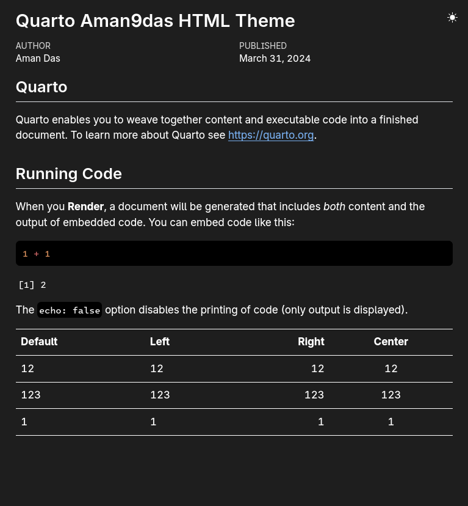
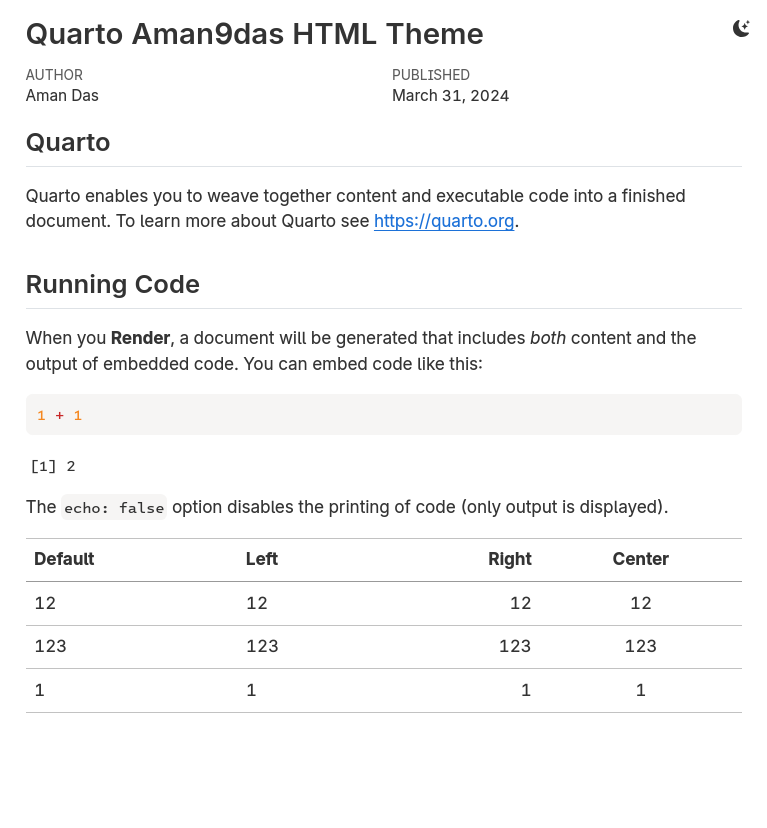

# Quarto Aman9das HTML Theme

## Installing

```bash
quarto use template aman9das/qmd-html
```

This will install the extension and create an example `qmd` file that you can use as a starting place for your article.

## Using

Drop-in replacement for html format.
Just use `aman9das-html` instead.

```yaml
format: aman9das-html
```

## Example

Here is the source code for a minimal sample document: [template.qmd](template.qmd).

|                 Dark                  |                  Light                  |
| :-----------------------------------: | :-------------------------------------: |
|  |  |
